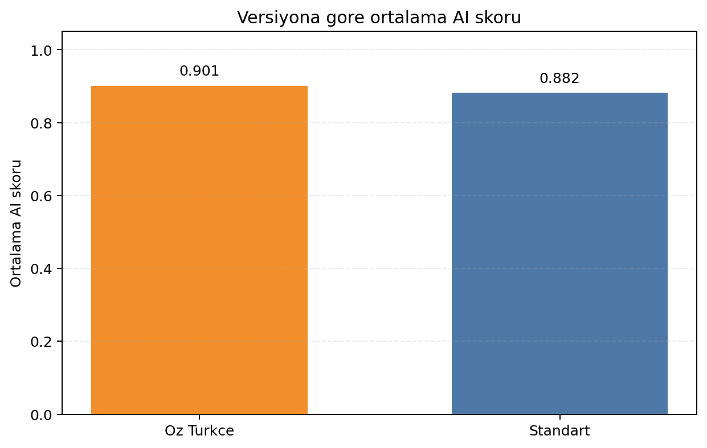
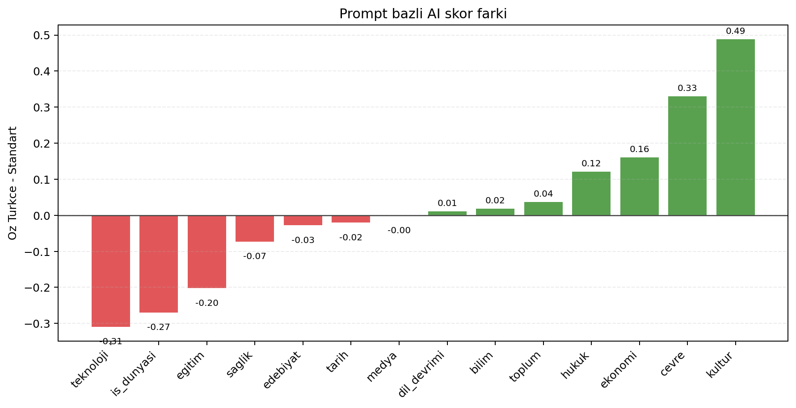

# Öz Türkçe × AI Tespiti

Bu proje, büyük dil modellerinin ürettiği Türkçe metinlerde **Öz Türkçe kelime kullanımının AI metin dedektörlerini etkileyip etkilemediğini** inceleyen deneysel bir araştırma pipeline'ıdır.

Amaç, aynı konu için üretilen `standart` ve `öz türkçe` sürümleri karşılaştırarak iki soruya cevap vermektir:

- Öz Türkçe kullanım yoğunluğu ölçülebiliyor mu?
- Bu dilsel değişim AI tespit skorlarında anlamlı bir fark üretiyor mu?

## Öne Çıkanlar

- Yerel LLM (`Ollama`) veya API tabanlı model ile metin üretimi
- Öz Türkçe oranı hesaplama ve CSV anotasyonu
- API gerektirmeyen dedektör akışı (`Hugging Face / roberta-base-openai-detector`)
- İstatistiksel testler (`Wilcoxon`, `paired t-test`)
- Makale yazımına uygun çıktı dosyaları ve özet tablolar

## Akış Diyagramı

.png)

## Sonuç Görselleri

### Ortalama AI skoru karşılaştırması



### Prompt bazlı farklar



## Mevcut Örnek Bulgular

Repodaki paylaşılan örnek çıktılarda:

- `Standart` metinlerin ortalama AI skoru: `0.8824`
- `Öz Türkçe` metinlerin ortalama AI skoru: `0.9013`
- Ortalama fark: `+0.0189`
- Wilcoxon testi p-değeri: `0.9032`
- Paired t-test p-değeri: `0.7469`

Bu örnek koşuda anlamlı bir fark gözlenmemiştir. Ayrıntılar `results/stats_sonuc.txt` ve `results/ozet_tablo.csv` içindedir.

## Proje Akışı

1. `src/generate.py` ile standart ve Öz Türkçe metinleri üret.
2. `src/annotate.py` ile Öz Türkçe oranını hesapla.
3. `src/export_metinler_for_detector.py` ile dedektör girdilerini hazırla.
4. `src/detector_binoculars.py` veya `src/detector.py` ile AI skorlarını al.
5. `src/analyze.py` ile özet tablo ve grafik üret.
6. `src/stats_test.py` ile istatistiksel karşılaştırmayı raporla.

## Kurulum

```bash
pip install -r requirements.txt
```

Ardından proje kökünde `.env` oluşturun. Örnek yapı için `.env.example` dosyasını kullanabilirsiniz.

- OpenAI kullanacaksanız: `OPENAI_API_KEY=...`
- Yerel model kullanacaksanız: `BACKEND=local`
- Ollama örneği: `LOCAL_BASE_URL=http://localhost:11434/v1`
- Yerel model adı örneği: `LOCAL_MODEL=qwen2.5:7b`

## Hızlı Başlangıç

### 1. Metin üretimi

```bash
python src/generate.py --local --limit 2
```

### 2. Öz Türkçe anotasyonu

```bash
python src/annotate.py
```

### 3. Dedektör skoru alma

API'siz önerilen yöntem:

```bash
python src/export_metinler_for_detector.py
python src/detector_binoculars.py
```

Alternatifler:

- Manuel web akışı: [GPTZero](https://gptzero.me) üzerinden skor alıp `src/merge_ai_skorlari.py` ile birleştirilebilir.
- API akışı: `.env` içine `DETECTOR_API_URL` ve gerekirse `DETECTOR_API_KEY` eklenip `python src/detector.py` çalıştırılabilir.

### 4. Analiz ve istatistik

```bash
python src/analyze.py
python src/stats_test.py
```

## Tek Komut

```bash
python run_all.py
```

Bu komut temel hattı sırayla çalıştırır: `generate -> annotate -> analyze`

## Klasör Yapısı

- `src/` : ana Python scriptleri
- `data/prompts.json` : konu ve prompt seti
- `data/oz_turkce_sozluk.txt` : Öz Türkçe sözlüğü
- `data/raw/` : model çıktıları
- `data/annotated/` : anotasyon ve dedektör CSV'leri
- `results/` : özet tablo ve istatistik raporları
- `assets/` : README görselleri
- `scripts/` : yardımcı scriptler

## Notlar

- Bu repodaki görseller `data/annotated/skorlar.csv` verisi üzerinden üretildi.
- README görsellerini yeniden üretmek için:

```bash
python scripts/make_readme_assets.py
```

- İkinci model eklemek için:

```bash
python src/generate.py --local --model llama3.2 --append
```


